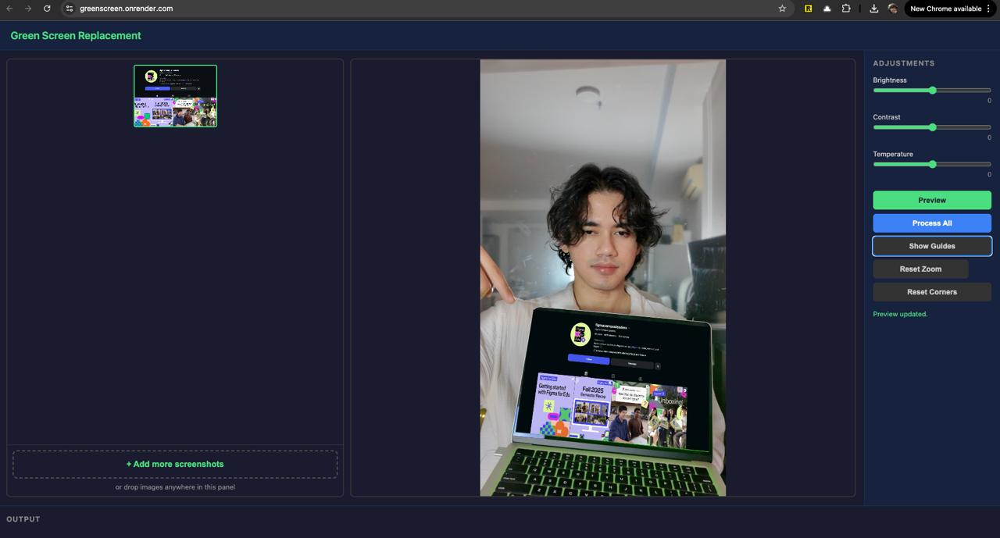

# Green Screen Replacement Tool

Replace green screens in images with screenshots or any other images. Automatically detects the green screen region, applies perspective transformation, and composites with lighting adjustments for a natural look.

Works as both a **CLI tool** and an **interactive web UI**.

**Try it live:** [greenscreen.onrender.com](https://greenscreen.onrender.com/)



## Features

- **Automatic green screen detection** — HSV thresholding + contour analysis to find and outline the green region
- **Perspective transform** — warps replacement images to match the green screen's shape and angle
- **Lighting adjustment** — auto-matches brightness to surrounding areas, or manually tune brightness, contrast, and temperature
- **Feathered compositing** — Gaussian-blurred alpha mask for smooth edges
- **Batch processing** — process multiple screenshots against the same base image
- **Interactive corner editing** — drag corner handles in the web UI with zoom (up to 8x) and pan support
- **Full resolution output** — all processing happens at original image quality, no resizing

## Quick Start

```bash
# Clone and set up
git clone https://github.com/mfrashad/greenscreen.git
cd greenscreen
python -m venv venv
source venv/bin/activate  # or venv\Scripts\activate on Windows
pip install -r requirements.txt
```

### Web UI

```bash
python server.py
# Open http://localhost:8000
```

1. Drop a **base image** (containing a green screen) on the right panel
2. Drop one or more **screenshots** on the left panel
3. Drag corner handles to fine-tune the green screen boundary
4. Adjust brightness, contrast, and temperature sliders
5. Click **Preview** to check the result, then **Process All** to export

### CLI

```bash
# Single image
python greenscreen.py --base laptop.png --screenshots hero.png --output result.png

# Batch processing
python greenscreen.py --base laptop.png --screenshots screen1.png screen2.png screen3.png

# Detect corners only (outputs JSON)
python greenscreen.py --base laptop.png --detect-only

# With manual adjustments
python greenscreen.py --base laptop.png --screenshots hero.png --output result.png \
  --brightness 10 --contrast 5 --temperature -3

# Custom corner positions (TL TR BR BL)
python greenscreen.py --base laptop.png --screenshots hero.png --output result.png \
  --corners "100,200 500,200 500,600 100,600"

# Adjust green detection sensitivity
python greenscreen.py --base laptop.png --screenshots hero.png --output result.png \
  --hue-range "30,90"
```

#### CLI Options

| Flag | Description | Default |
|------|-------------|---------|
| `--base` | Base image with green screen (required) | — |
| `--screenshots` | One or more replacement images | — |
| `--output` | Output path (single image mode) | — |
| `--output-dir` | Output directory (batch mode) | `./output` |
| `--corners` | Manual corners as `x,y x,y x,y x,y` (TL TR BR BL) | Auto-detect |
| `--brightness` | Brightness shift (-100 to 100) | `0` |
| `--contrast` | Contrast scale (-100 to 100) | `0` |
| `--temperature` | Warm/cool shift (-50 to 50) | `0` |
| `--hue-range` | Green HSV hue range as `low,high` | `35,85` |
| `--detect-only` | Print detected corners as JSON and exit | — |

## How It Works

1. **Green mask detection** — converts the base image to HSV and thresholds for green hues, then cleans with morphological operations (close + open)
2. **Corner finding** — finds the largest contour and approximates it to a 4-point polygon (falls back to minimum area rectangle)
3. **Corner ordering** — sorts the 4 points into TL, TR, BR, BL using a sum/difference heuristic
4. **Perspective warp** — computes a perspective transform matrix and warps the screenshot into the quadrilateral
5. **Lighting adjustment** — either auto-matches the L channel in LAB color space to the surrounding region, or applies manual brightness/contrast/temperature shifts
6. **Compositing** — alpha-blends the warped screenshot onto the base using a Gaussian-blurred mask for feathered edges

## API Endpoints

The web server exposes these endpoints:

| Method | Path | Description |
|--------|------|-------------|
| `GET` | `/` | Web UI |
| `POST` | `/api/detect` | Upload base image, returns detected corners + preview |
| `POST` | `/api/preview` | Generate a preview composite with given parameters |
| `POST` | `/api/process-one` | Process a single screenshot at full resolution, returns PNG |

## Deploy to Render

[](https://render.com/deploy?repo=https://github.com/mfrashad/greenscreen)

Or deploy manually:

1. Fork this repo
2. Create a new **Web Service** on [Render](https://render.com)
3. Connect your fork, select the `main` branch
4. Render will auto-detect the `Dockerfile` — no extra config needed
5. Choose the **Free** plan and click **Deploy**

The free tier spins down after 15 minutes of inactivity (expect a 30-60s cold start on the first request).

## Requirements

- Python 3.8+
- OpenCV (headless)
- NumPy
- FastAPI + Uvicorn (for web UI)

## License

MIT
